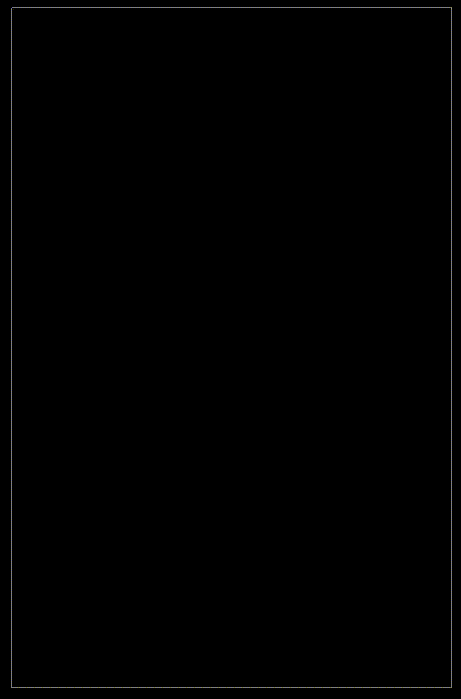

# Sand Art Demo

A simple sand physics demo written in Zig using Raylib.

## Mouse 

Press and hold left mouse button to create sand

## Build Instructions and Dependencies

Zig can call raylib natively since zig can compile both c
and zig code, the demo can be built and ran using 

`zig build run`

A release build can be created with the following command.

`zig build -Doptimize=ReleaseFast`

This project was created on macOS Sequoia Version 15.0.1, with
zig version 0.14.0-dev.1991+33d07f4b6. Zig can be downloaded 
[Here](https://ziglang.org/download/)

I have not tested this app on anything other than macOS, I cannot
guarantee it will work on Windows or Linux.
